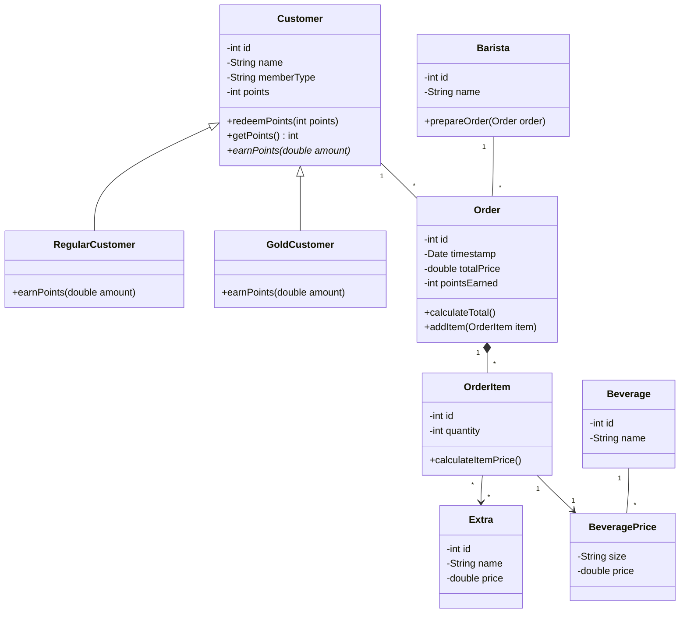
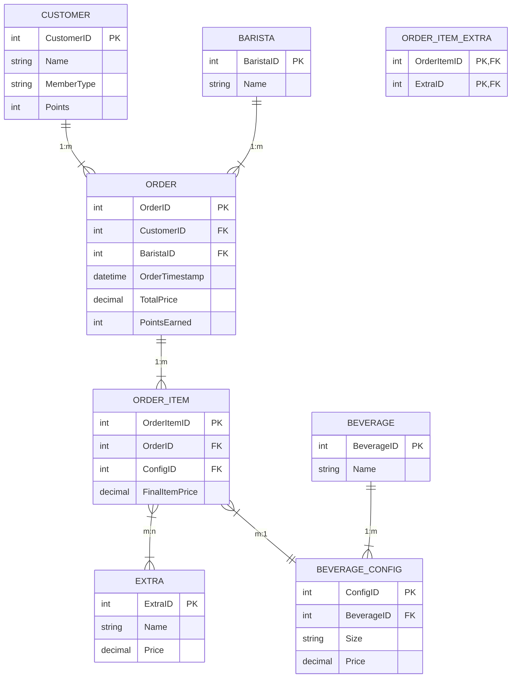

# Task Siemens 2026

## Problem 1
This project is a digitization of operations for Sarah's coffee shop chain. The system is designed to handle orders, customize beverages, track barista performance, and manage a customer loyalty program.

**Features:**
* **1:** Supports various drinks (Espresso, Latte, Cappuccino) across three sizes (Small, Medium, Large) with dynamic pricing.
* **2:** Allows adding extras (extra shot, vanilla syrup, caramel syrup, whipped cream) to any drink.
* **3:** Tracks customer purchases to award points. Regular members earn 1 point per euro, while Gold members earn 2 points per euro. Points can be redeemed for free drinks.
* **4:** Records which barista prepared which order, along with timestamps and total order prices.

### 1.1 Class Diagram
The UML diagram below outlines the system's object-oriented architecture. It uses a composition relationship between Order and OrderItem to ensure data integrity and includes a BeveragePrice class to handle the dynamic pricing of different sizes for each drink type.

### 1.2 Database diagram
The relational schema is designed for 3rd Normal Form (3NF) normalization. It successfully resolves the many to many relationship between orders and extras using a junction table (ORDER_ITEM_EXTRA) and ensures pricing consistency through BEVERAGE_CONFIG.

