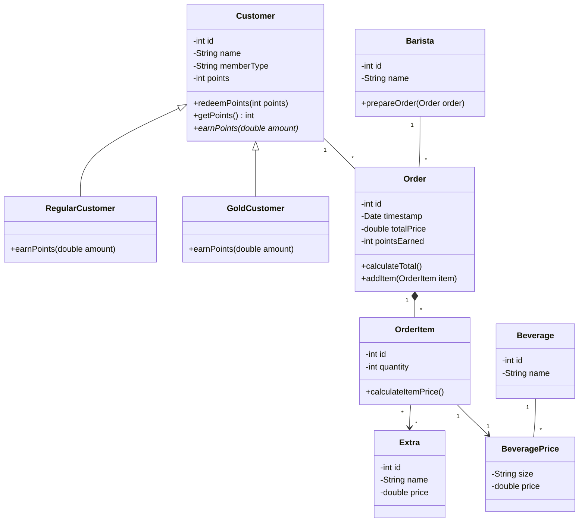
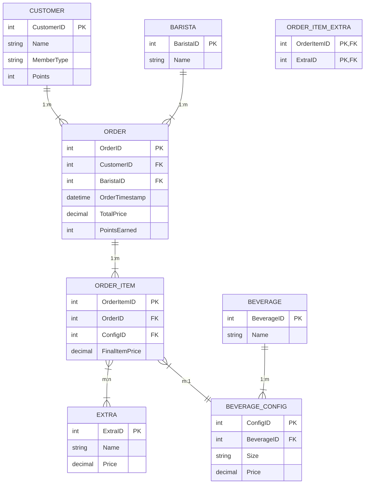

# Task Siemens 2026

## Problem 1
This project is a digitization of operations for Sarah's coffee shop chain. The system is designed to handle orders, customize beverages, track barista performance, and manage a customer loyalty program.

**Features:**
* **1:** Supports various drinks (Espresso, Latte, Cappuccino) across three sizes (Small, Medium, Large) with dynamic pricing.
* **2:** Allows adding extras (extra shot, vanilla syrup, caramel syrup, whipped cream) to any drink.
* **3:** Tracks customer purchases to award points. Regular members earn 1 point per euro, while Gold members earn 2 points per euro. Points can be redeemed for free drinks.
* **4:** Records which barista prepared which order, along with timestamps and total order prices.

### 1.1 Class Diagram
The UML diagram below outlines the system's object-oriented architecture. It uses a composition relationship between Order and OrderItem to ensure data integrity and includes a BeveragePrice class to handle the dynamic pricing of different sizes for each drink type.



### 1.2 Database diagram
The relational schema is designed for 3rd Normal Form (3NF) normalization. It successfully resolves the many to many relationship between orders and extras using a junction table (ORDER_ITEM_EXTRA) and ensures pricing consistency through BEVERAGE_CONFIG.





## Problem 2

This project models an order management system for SieMarket, an online electronics store that processes hundreds of orders daily across Europe. The system handles order creation, discount application, and sales analytics.

**Features:**
* **1:** Represents orders and their items with appropriate properties such as product name, quantity, and unit price at time of purchase.
* **2:** Calculates the final price of an order, automatically applying a 10% discount when the order total exceeds 500€.
* **3:** Identifies the top spending customer by aggregating the final prices of all their orders.
* **4:** Returns all products along with their total quantity sold across all orders.

### Solution Structure
The solution is split into three classes, each one having a single responsability:

- **`OrderItem`** — represents a single product line in an order, holding the product name, quantity, unit price, and a computed subtotal
- **`Order`** — represents a customer's order, containing a list of `OrderItem` objects and the logic to calculate the final price with the discount rule applied
- **`OrderService`** — acts as the business logic layer, operating over a collection of orders to provide analytics such as the top spending customer and product sales totals

### Setup & Running
1. Make sure you have the [.NET SDK](https://dotnet.microsoft.com/download) installed.
2. Clone or download the project.
3. Navigate to the project folder and run:
```bash
dotnet run
```
The console will output the final price for each order, the top spending customer, and the total units sold per product.


### Test Cases
Tests are written using **xUnit** and located in the `SieMarket.Tests` project. To run them:
```bash
dotnet test
```

#### Tests that should PASS

**No discount when total is exactly 500€**
The discount rule only applies when the total *exceeds* 500€, so an order totaling exactly 500€ should return the full price.
```csharp
[Fact]
public void CalculateFinalPrice_NoDiscount_WhenTotalEqualsThreshold()
{
    var order = new Order(1, "alice");
    order.Items.Add(new OrderItem("monitor", 1, 300));
    order.Items.Add(new OrderItem("keyboard", 1, 200)); // total = 500

    Assert.Equal(500, order.CalculateFinalPrice());
}
```

**Discount applied when total exceeds 500€**
An order totaling 510€ should have the 10% discount applied, resulting in 459€.
```csharp
[Fact]
public void CalculateFinalPrice_AppliesDiscount_WhenTotalExceedsThreshold()
{
    var order = new Order(1, "alice");
    order.Items.Add(new OrderItem("laptop", 1, 450));
    order.Items.Add(new OrderItem("earbuds", 2, 30)); // total = 510

    Assert.Equal(459, order.CalculateFinalPrice()); // 510 * 0.90 = 459
}
```

**Single item below threshold, no discount**
```csharp
[Fact]
public void CalculateFinalPrice_NoDiscount_WhenSingleItemBelowThreshold()
{
    var order = new Order(2, "bob");
    order.Items.Add(new OrderItem("tv", 1, 300));

    Assert.Equal(300, order.CalculateFinalPrice());
}
```

**Correct top spending customer**
Alice spent 459€ (discount applied), Mary 400€, Bob 300€ — so Alice should be returned.
```csharp
[Fact]
public void GetTopSpendingCustomer_ReturnsCorrectCustomer()
{
    var orders = new List<Order>
    {
        new Order(1, "alice") { Items = { new OrderItem("laptop", 1, 450), new OrderItem("earbuds", 2, 30) } },
        new Order(2, "bob")   { Items = { new OrderItem("tv", 1, 300) } },
        new Order(3, "mary")  { Items = { new OrderItem("keyboard", 5, 80) } }
    };
    var service = new OrderService(orders);

    Assert.Equal("alice", service.GetTopSpendingCustomer());
}
```

**Popular products returns correct quantities**
The same product ordered across multiple orders should have its quantities summed correctly.
```csharp
[Fact]
public void GetPopularProducts_ReturnsCorrectQuantities()
{
    var orders = new List<Order>
    {
        new Order(1, "alice") { Items = { new OrderItem("keyboard", 2, 80) } },
        new Order(2, "bob")   { Items = { new OrderItem("keyboard", 1, 80) } }
    };
    var service = new OrderService(orders);

    var result = service.GetPopularProducts();

    Assert.Equal(3, result["keyboard"]); // 2 + 1 = 3
}
```

#### Tests that should FAIL

**Expects full price but discount should apply**
This test incorrectly expects 510€ — the actual result is 459€ because the discount is applied.
```csharp
[Fact]
public void CalculateFinalPrice_WrongExpectation_IgnoresDiscount()
{
    var order = new Order(1, "alice");
    order.Items.Add(new OrderItem("laptop", 1, 450));
    order.Items.Add(new OrderItem("earbuds", 2, 30)); // total = 510

    Assert.Equal(510, order.CalculateFinalPrice()); // WRONG: actual is 459
}
```

**Wrong customer expected**
This test expects Bob, but Alice is the top spender.
```csharp
[Fact]
public void GetTopSpendingCustomer_WrongCustomerExpected()
{
    var orders = new List<Order>
    {
        new Order(1, "alice") { Items = { new OrderItem("laptop", 1, 450), new OrderItem("earbuds", 2, 30) } },
        new Order(2, "bob")   { Items = { new OrderItem("tv", 1, 300) } },
        new Order(3, "mary")  { Items = { new OrderItem("keyboard", 5, 80) } }
    };
    var service = new OrderService(orders);

    Assert.Equal("bob", service.GetTopSpendingCustomer()); // WRONG: actual is alice
}
```

**Wrong quantity expected**
This test expects 5 units of keyboard sold, but the actual total is 3.
```csharp
[Fact]
public void GetPopularProducts_WrongQuantityExpected()
{
    var orders = new List<Order>
    {
        new Order(1, "alice") { Items = { new OrderItem("keyboard", 2, 80) } },
        new Order(2, "bob")   { Items = { new OrderItem("keyboard", 1, 80) } }
    };
    var service = new OrderService(orders);

    var result = service.GetPopularProducts();

    Assert.Equal(5, result["keyboard"]); // WRONG: actual is 3
}
```